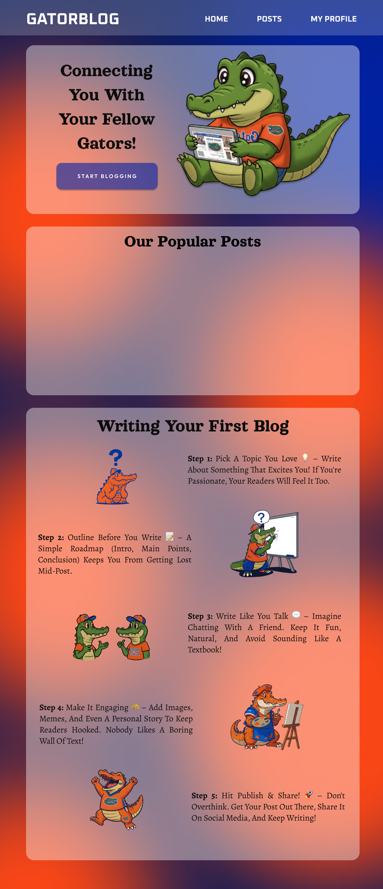
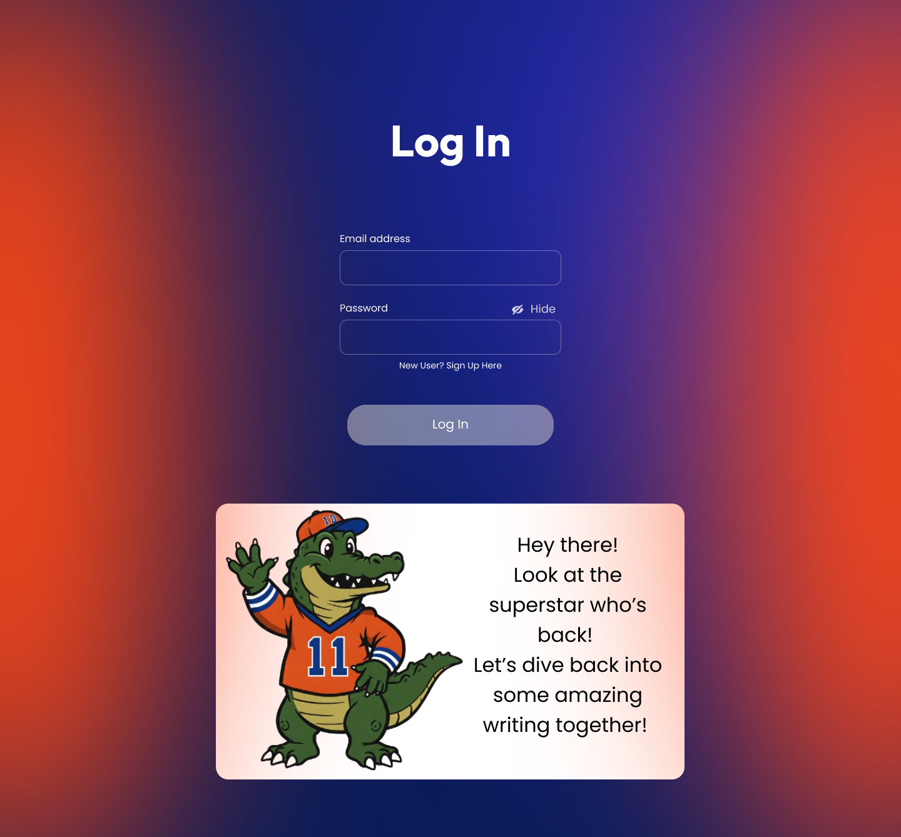
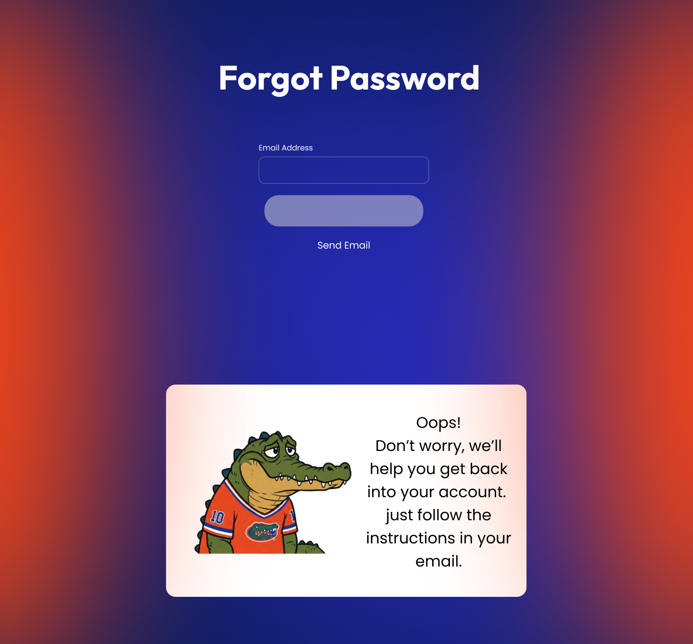

# Sprint 1 Documentation

## Project Name: Gator Blog
**Sprint Duration:**  01/17/2025 -  02/10/2025  

**Team Members:**  
- Durga Sritha Dongla - Front End  
- KJ Pressly - Front End  
- Saranya Yadlapalli - Back End  
- Sai Harshitha Baskar - Back End  

---

## 1. Sprint Goal
The objective of Sprint 1 was to set up the foundational structure of the Gator Blog website, including backend and frontend scaffolding, user authentication, and basic blog post functionality.

---

## 2. Visual Demo Links

- [Backend](https://drive.google.com/file/d/1tCvaU9pqi-oNjlQk_R_mWCj3Ye4fwqIx/view?usp=sharing)
- [Frontend](https://drive.google.com/file/d/199bBifRV6AD6nhttEP_KHXulvb8PjgNC/view?usp=drive_link)
- Link to the Repository: https://github.com/SE-Project-GatorBlog/Gator_Blog/
---

## 3. User Stories

| User Stories | Explanation | Implemented |
|-------------|-------------|--------------|
| As a developer, I want to set up the backend environment and codebase | To ensure the project is structured properly | ✅ |
| As a user, I want a homepage with essential features | To navigate and explore the blog | ✅ |
| As a user, I want to register through a secure API that stores my credentials safely | To protect personal data | ✅ |
| As a user, I want to log in through a secure API that validates my credentials and returns a session/token | To stay authenticated | ✅ |
| As a developer, I want to implement JWT authentication for Signup & Signin APIs | To enhance security and provide token-based authentication | ✅ |
| As a frontend developer, I want to set up the frontend environment and codebase | To build and test UI components efficiently | ✅ |
| As a user, I want a secure and user-friendly signup page | To easily create an account | ✅ |
| As a user, I want a secure and user-friendly login page | To easily access my account | ✅ |
| As a developer, I want to set up a MySQL database connection using GORM | To efficiently manage data | ✅ |
| As a user, I want to comment on blog posts | To engage with authors and other readers | ❌ |
| As a user, I want to like blog posts | To show appreciation for good content | ❌ |
| As a user, I want to edit my blog posts after publishing | To correct mistakes or update content | ❌ |

### 3.1 Reasons for Not Implementing Certain Features

- **Commenting on Blog Posts:** This feature was deprioritized in Sprint 1 as the focus was on establishing core authentication and backend setup. It will be implemented in the next sprint.  
- **Liking Blog Posts:** Implementing a like feature requires additional modifications to the database schema and was planned for a future sprint to maintain the sprint timeline.  
- **Editing blog posts after publishing** Editing functionality requires implementing version control and additional backend logic, which were deprioritized for this sprint. 

---

## 4. Tasks Completed
### Backend Setup:
- Initialized the project with Go and MySQL.
- Established DB Connection and API routing using Gorm frameworks.
- Set up user authentication using OAuth/Email & Password.
- Implemented REST API endpoints for RegisterUser, LoginUser APIs on blog posts.
- Created database models for Users and Blog Posts.
- Implemented JWT authentication: A JWT token is generated upon successful registration.
- Passwords are hashed before storing in the database to enhance security.

### Frontend Setup:
- Implemented a Figma design for the frontend UI.
- Did the initial setup of the React application and installed required libraries/dependencies.
- Created the MainComponent and set up the routing paths.
- Designed basic UI for user authentication.
- Created components for login and sign-up pages.

### Database:
- Configured MySQL for storing user and blog data.

### Deployment & DevOps:
- Configured a local development environment.
- Set up a version control system (GitHub).

### Figma Designs:
  
  
  
 

---

## 5. Testing:
- Tested test-API using Postman and validated respective changes in DB.
- Tested CRUD operations in DB by calling APIs through Postman.
- Tested the User Interface by hosting on a localhost server.

---

## 6. Challenges Faced
- Integration issues between frontend and backend APIs.
- User authentication security concerns and OAuth implementation difficulties.
- Database schema adjustments to accommodate additional fields.

---

## 7. Lessons Learned
- Importance of defining clear API contracts early in the sprint.
- Need for detailed documentation to ensure smooth collaboration.
- Using test-driven development (TDD) helped identify issues early.

---

## 8. Sprint Retrospective
### What Went Well:
- Successfully set up project structure and implemented core features.
- Good team collaboration and task distribution.
- Effective use of version control and issue tracking.

### What Could Be Improved:
- More detailed user stories and acceptance criteria.
- Better planning for API integrations to reduce delays.
- Improved time estimation for tasks.

---

## 9. Next Steps
- Implement commenting and liking features.
- Improve UI design and user experience.
- Conduct usability testing and gather user feedback.

